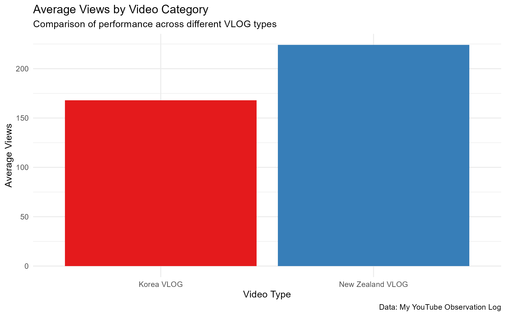
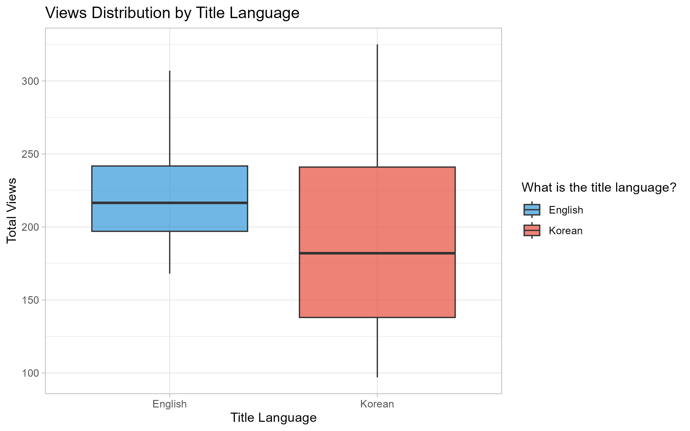
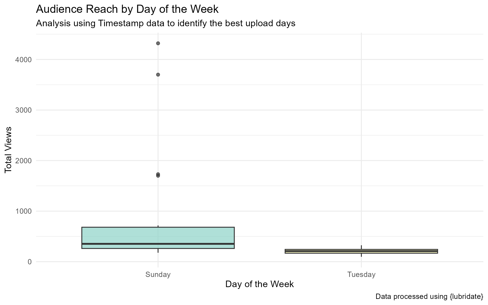

```{r setup, include=FALSE}
knitr::opts_chunk$set(echo=FALSE, message=FALSE, warning=FALSE, error=FALSE)
```
```{js, echo=FALSE}
$(function() {
  $(".level2").css('visibility', 'hidden');
  $(".level2").first().css('visibility', 'visible');
  $(".container-fluid").height($(".container-fluid").height() + 300);
  $(window).on('scroll', function() {
    $('h2').each(function() {
      var h2Top = $(this).offset().top - $(window).scrollTop();
      var windowHeight = $(window).height();
      if (h2Top >= 0 && h2Top <= windowHeight / 2) {
        $(this).parent('div').css('visibility', 'visible');
      } else if (h2Top > windowHeight / 2) {
        $(this).parent('div').css('visibility', 'hidden');
      }
    });
  });
});
```
```{css, echo=FALSE}
body {
  background-color: #ffffff;
  color: #2c3e50;
  font-family: 'Segoe UI', Roboto, Helvetica, Arial, sans-serif;
  line-height: 1.6;
}
h2 {
  color: #c0392b; 
  border-bottom: 2px solid #ecf0f1;
  padding-bottom: 15px;
  margin-top: 150px;
}
.level2 {
  margin-bottom: 600px; 
  padding: 20px;
}
img {
  border-radius: 8px;
  box-shadow: 0 4px 12px rgba(0,0,0,0.1);
  margin: 20px 0;
  max-width: 100%;
}
```
## Intro
Building on the video observation project from Project 2, I have expanded my data collection to focus on strategic content creation patterns for my personal YouTube channel. In this phase, I introduced two specific new variables: Title Language (categorizing videos as Korean or English) and Comment Counts. The inclusion of Title Language allows me to analyze whether linguistic choices impact international reach, while tracking Comment Counts provides a deeper metric for audience engagement beyond passive views.

Furthermore, I leveraged the system-generated Timestamp data using the {lubridate} package in R. By transforming these raw time logs into a Day of the Week variable, I could identify the most effective windows for uploading content. This data-driven approach aims to move beyond simple logging and towards a professional understanding of how specific technical and temporal choices—such as linguistic framing and upload timing—influence overall video performance and viewer interaction.

## 1. Average Views by Video Category
The first step in my analysis was to determine which type of content performs best on average. By grouping the data by video type, I could see a clear comparison between different categories.

This visualisation helps identify which topics are currently most appealing to the audience, allowing for a more focused content strategy in future uploads.The chart clearly shows that New Zealand VLOGs achieve a higher average view count compared to Korea VLOGs, indicating that local content currently resonates more strongly with my audience.

## 2. Impact of Language on Video Reach
As an international creator, I often choose between Korean and English for my video titles. I used a boxplot to see how this choice influences the distribution of total views.


The distribution shows not just the average, but also the range of performance, helping me decide if English titles truly help in reaching a wider global audience compared to Korean titles.While the median views for English titles are slightly higher and more consistent, Korean titles exhibit a wider range of performance, suggesting that language choice significantly impacts the stability of video reach.

## 3. Optimal Upload Timing: Day of the Week Analysis
Finally, I utilized the Timestamp variable from my logging data to determine the best days for audience reach. By using the {lubridate} package to extract days of the week, I could analyze how view counts vary depending on when a video is published.

This boxplot reveals the distribution of engagement across different days, helping to identify peak performance periods. Such insights are crucial for developing a data-driven upload schedule that maximizes initial viewer traction.
Notably, Sunday uploads show a much higher potential for viral reach with significant outliers, whereas Tuesday uploads tend to result in more modest but predictable engagement levels.